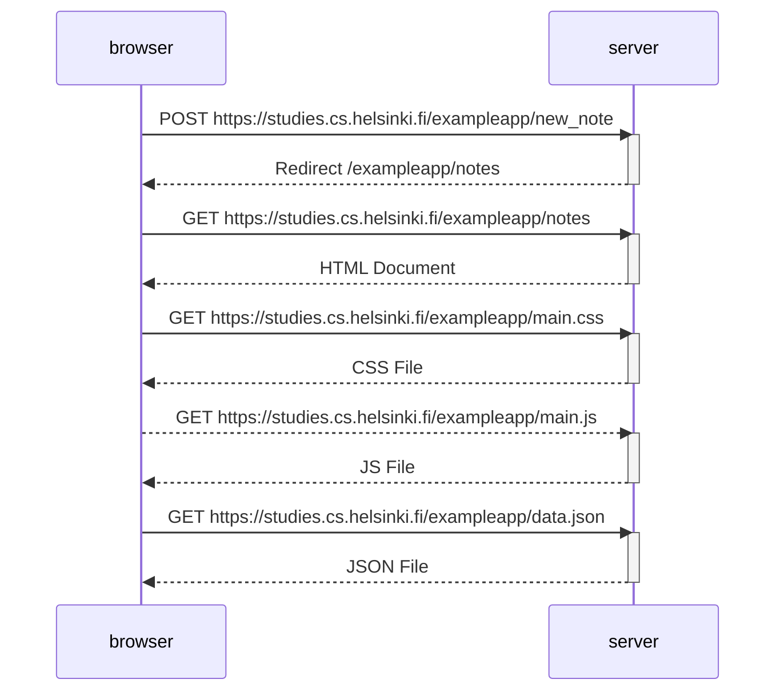
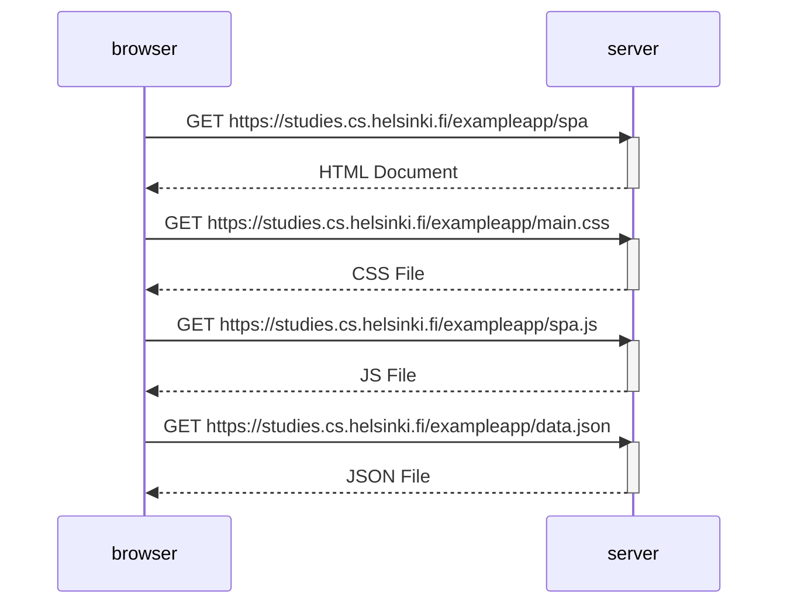
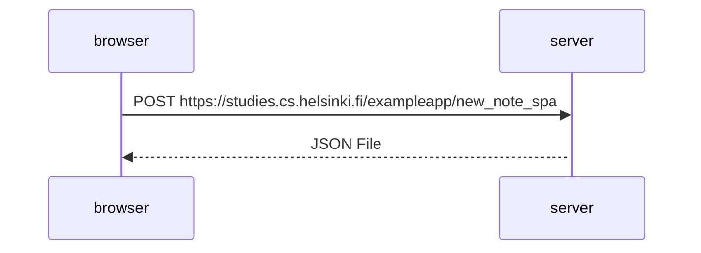

# Part 0

## 0.1 - 0.3: Review Basics

**Objective**: Read the following articles to review basics.

HTML tutorial: https://developer.mozilla.org/en-US/docs/Learn/Getting_started_with_the_web/HTML_basics

CSS tutorial: https://developer.mozilla.org/en-US/docs/Learn/Getting_started_with_the_web/CSS_basics

HTML forms: https://developer.mozilla.org/en-US/docs/Learn/HTML/Forms/Your_first_HTML_form

## 0.4: New Note Diagram

**Objective:** Create a similar diagram depicting the situation where the user creates a new note on the page https://studies.cs.helsinki.fi/exampleapp/notes by writing something into the text field and clicking the Save button.

## 0.5: Single page app diagram

**Objective:** Create a diagram depicting the situation where the user goes to the single-page app version of the notes app at https://studies.cs.helsinki.fi/exampleapp/spa.

## 0.6: New note in Single page app diagram

**Objective:** Create a diagram depicting the situation where the user creates a new note using the single-page version of the app.

